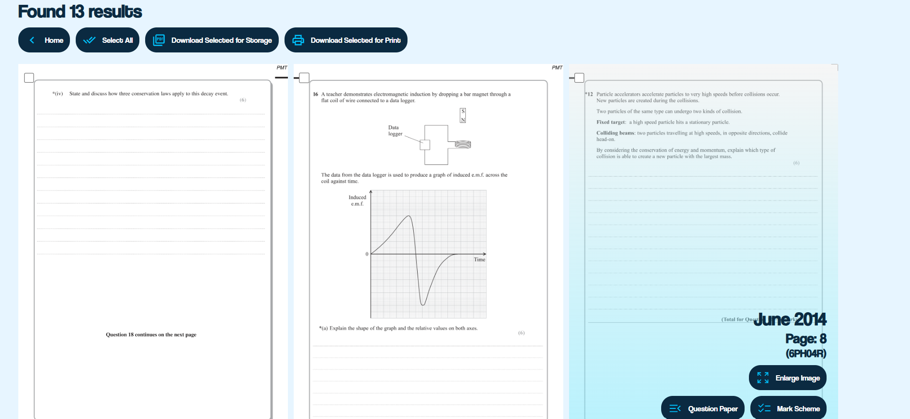

Inspired by [CAIE Finder](https://caiefinder.com/)
# [Edexcel Finder](https://edexcel-finder.onrender.com/)
> Use Case
- It can be used to identify which year a specific question is from 
- Can help make topicals/ chapterwise papers to practice
- Works **both** on mobile and desktop

- Like this ⤴️ any _common_ term can be searched for and that would give a list of all questions containing that term

- Hovering upon the image gives more details. It also links to the main Question Paper and Mark Scheme file for convenience
> Backend
- Like Marking Companion, Flask is the library that I used as the backbone for the project
- Using Whoosh I indexed a vast libraray of papers [January 2019 - January 2024]
    - It allowed me to quickly search the database instead of brute force searching through every single file *which I previously had been doing*
- I also moved away from `pdf2image` and moved to `fitz` as it is much quicker and has no extra dependencies like Poppler
> Frontend
- Raw HTML and CSS has been used
- Used a [mountain](https://www.pexels.com/photo/aerial-photography-of-pine-trees-on-the-mountain-9754/) as the background because it made me feel I was paying homage to the evergreen Windows 7 Scenery
---
- The fun in doing such projects is learning about different things in order to optimise your code, I loved learning about Whoosh and how it worked behind the scenes
- Indexing and converting `pdfs` to `txts` was also real fun
---
⚠️ DISCLAIMER: It's not a finished project yet, there's potential for so much more, after my AS Exams I'll In Sha Allah look into them
