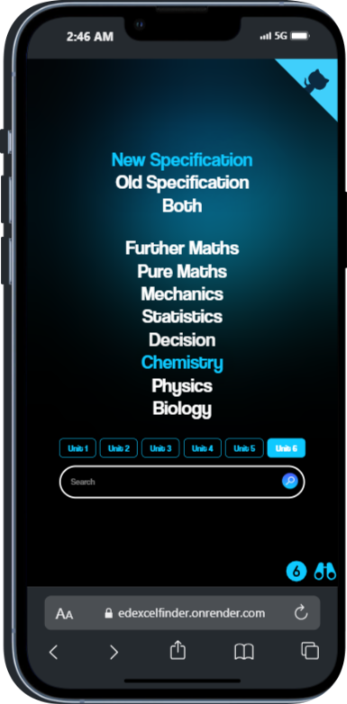
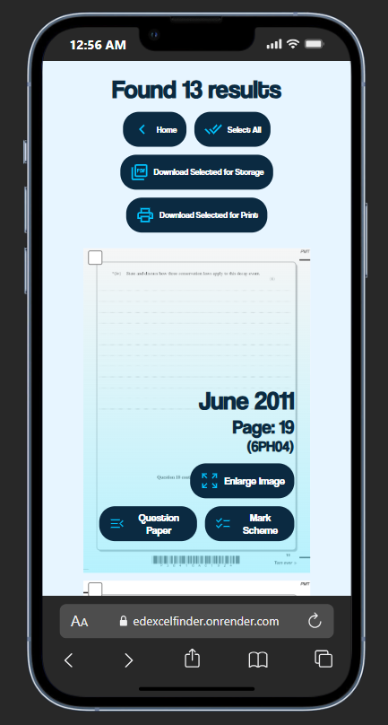

Inspired by [CAIE Finder](https://caiefinder.com/)
# [Edexcel Finder](https://edexcelfinder.onrender.com/)

## Purpose of the site
- It is to help you *quickly* practice papers based on specific topics
- Emphasis on quickly because you can also Google for papers and go on about studying
    - Although that is true, it is not efficient
    - With Edexcel Finder, you have everything at **one destination**
- You get the Question Paper and Mark Scheme Links together
- An image is generated so that you can have a quick glance
    - If the image by itself doesn't suffice your needs, you can press the Question Paper button and if you are on desktop it would open it to the exact page from which you can navigate to other pages

## How to use
- It can be used to identify which year a specific question is from 
    - The more exact your search term is is, the __more quicker and curated__ the results
- Can help make topicals/ chapterwise papers to practice
    - You can search for terms that are often alongside questions of a certain topic
    - Or search the topic itself, like to practice Capacitor Questions, searching `capacitor` should suffice
Works **both** on mobile 📱 and desktop 🖥️
## Demonstration
| Mobile Home Page | Mobile Results Page |
|------------------|--------------------|
|  |  |

| Desktop Home Page | Desktop Results Page |
|-------------------|---------------------|
|  |  |
- Like this ⤴️ any _common_ term can be searched for and that would give a list of all questions containing that term

- Hovering upon the image gives more details

## Backend
- Like [Marking Companion](https://github.com/anonymouslyanonymous1/Marking-Companion) & [Edexcel Charts](https://github.com/anonymouslyanonymous1/Edexcel-Charts), Flask is the library that I used as the backbone for the project
- Whoosh for searching through the indexed files
- Fitz to create images of the pdfs
## Frontend
- Raw HTML and CSS has been used
- Used a [mountain](https://www.pexels.com/photo/aerial-photography-of-pine-trees-on-the-mountain-9754/) as the background because it made me feel I was paying homage to the evergreen Windows XP scenery/grass wallpaper
## Extraction, Index, Search
- For the files itself, check the link at the top
- `static/Fetch` contains all the Question Papers and Mark Schemes for every year as JavaScript Objects
- `static/Paper`, right now it contains only the Sample Papers, but during production it had all the papers downloaded
    - During deployment I changed to downloading papers only when needed to save on storage
- `static/Data` contains all the text and page, Question Paper, Mark Scheme for every unit of every subject as JavaScript Objects
    - This was made by analysis of `static/Paper`
- `static/Index` contains the index files that Whoosh requires for searching
    - It is made by iterating through `static/Data`
- The search is done by Whoosh. It goes to the particular directory of what user wants and goes through the index files in it
    - During indexing, the _Year, Page, QP_Link, MS_Link_ were included alongside each page's content
    - So querying automatically gives everything needed
## Changelog: v1
- Using Whoosh I indexed a vast libraray of papers [January 2019 - January 2024]
    - It allowed me to quickly search the database instead of brute force searching through every single file *which I previously had been doing*
- I also moved away from `pdf2image` and moved to `fitz` as it is much quicker and has no extra dependencies like Poppler
- Added `#page={page}` to all Question Paper links so that upon click it opens at the exact page
- Added an error page that contains the error logged
- Added a Home Button in the results page to easily go back to Home page
## Changelog: v2
- Revamped the whole algorithm
    - Moved from saving data to `.txt` files to saving it in the form of `.JSON`
        - Page number is accounted into JSON during data extraction rather than using _---- End of Page: x ----_
    - Indexed each unit of each subject separately instead of saving all units and all subjects in one index file
    - This solved the issue of Sample Paper's images coming up more than once unnecessarily
- Added Biology, Decision
- Added Old Specification papers for all of them going as far as **2009** for Sciences and **2014** for Mathematics *[barring C1234]*
    - Unused papers, R papers have also been added alongside for both New/Old Specification if available 
- Added filters to allow choice of results from a particular version of specification or both
    - Side Note: New/Old alone > Both in terms of speed as lesser number files to search through and produce images for
- Made the Github icon a tad bit nicer (added animation)
## Changelog: v3
- Added prevention of multiple processes being initiated due to press of Search button multiple times by disabling Search button after first submission
- Made it required/ a must to fill up all inputs _[Search, Subject, Unit, Specification]_
- Saved choice of closing banner to browser's localStorage
    - To ensure there is no disturbance to user experience
- Added an **enlarge** link alongside the other information in `/results`
    - This is to ensure image can be read easily
- Images were being deleted for one if two or more users were using site simulataneously, so differentiated every user with an **unique Sessions id**
    - Added a scheduler which would clear each user's unique folder after 400 seconds of returning results
    - So, user has about ~6 minutes to enlarge results
- Added icons to the buttons in the results page
## Ideas from users
- Link to enlarge image: @cyberelixer [Discord]
- June 2017 data fix, date sequencing: @cor_.z [Discord]
- Brought an error to my notice: @jazz_exe10 [Discord]
    - This led to the user ID differentiation and schedule deletion instead of immediate deletion upon request coming in
- Toggle for old and new specification: @mere.illusion and @crysliz [Both Discord]
- Addition of Biology: @subelemambopakemigataprendalomot [Discord]
- https://edexcelfinder.onrender.com/SixMark suggested by @999remaining [Discord]
    - This is a compilation of all the descriptive/mathematical 6 markers that have come up in previous years for the Sciences [January 2010 to January 2024]
- https://edexcelfinder.onrender.com/SixMarkSearch suggested by @subelemambopakemigataprendalomot [Discord]
    - Also suggested adding redirect buttons on the two aforementioned routes
